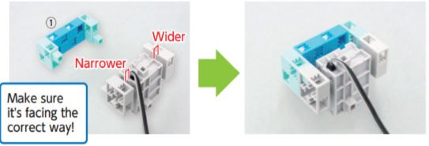
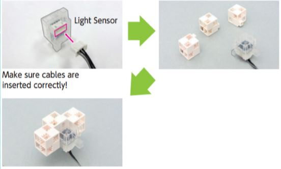

# Block Thrower Project
## Introduction
> #### Block Thrower
> Catapults have been used a lot throughout history, whether it be for defending a castle or lauching a watermelon at a target! They're typically made out of wood and rope, but then one you're about to build is going to be way more advanced than that.
> ### Fun Fact
> The first ever recorded catapult was built in 400 BC!

---

> #### What Will I Learn?
> This project will teach you how to build a robot into a catapult! Not only does it throw objects, but it will have the ability to detect if there is an object to throw!

---

> #### The Main Purpose Of Building This Robot:
> You've already built a robot that moves its legs, so now it's time to build a robot that can throw objects! This is done by using an attached sensor that will let the robot sense whether there is an object ready to be thrown.

---

## Activity 1
### Building the Block Thrower
Once again, before using the servomotor, make sure you know which side is which. This can be done by recognizing which side is narrow, and which side is wide. This image below you can help you recognize the sides.

### What You Need To Build:
> * 2 Aqua Blocks
> * 2 Light Aqua Blocks
> * 7 White Blocks
> * Blue LED Light
> * Light Sensor
> * 2 Sensor Cables 
> * Studuino Unit 
> * Battery Box 
> * USB Cord
> ### Note that the colors of the blocks don't really matter, just make sure you have the right amount of what ever color block you choose.

---

### 1
Assemble the blocks as shown.

### 2 
Using the image below as a guide, add the **Servomotor** to the part you built in the previous step.

### 3 
Now add the part to the circuit borad, AKA the studuino unit.

### 4
Connect the **sensor cable** to the **light sensor**. Add 3 white blocks, or which ever color blocks you chose to the **light sensor**, as shown below.

### 5 
Connect the **sensor cable** to the **Blue LED**. Add 3 more white or which ever color blocks you chose to the **LED** as shown below.

### 6
Connect the parts from step 4 and 5 to create a new part.

### 7
Next, connect the parts from step 3 and 6 as shown below.

### 8 
Now insert the cables. Make sure that hey grey wire is facing the center, or else it won't work properly.

### 9 
This is what the should look like.

## Great Job Ninja!
You have mastered the art of creating your very own Block Thrower! Continue on to your next activity lesson!

## Activity 2
### Coding The Block Thrower 
Now it's time to code your Block Thrower! Connect your USB to the computer and open Studuino. Select the **Block Programming Environment,** then select the **Robots** tab to transfer code that you'll make to the robot you built!

### 1
Go to the **edit** menu and select **Port Settings** from the drop-down. 

