# Collison Detecting Robot Project 
## Introduction
> ### Collision Detecting Robot
> Your catapult was pretty cool right? well now we'll build a robot that can actually move around by itself and detect when it's going toward an object! 

---

> ### What Will I Learn?
> This project will teach you how to program your robot to detect collisions. For example, if there is an object in front of your robot while it's moving, it will move around it!
> One thing to note is now we are bringing in a different motor called a **DC Motor**. Some DC Motors are used in automobiles and trains to deliver high amounts of power like in electric trains and cars to make them go forward and backward!

---

> ### The Main Purpose Of Building This Robot
> On the Servo Walker project we taught you how to program a robot to move in a crawling manner, and in the Block Thrower project we detected if there is a block to be thrown. In this project, we will combine those projects into a single robot that can move by itself!

---

## Activity 1
### Building The Collision Robot 
### What You Need To Build:
> * 2 DC Motors And Parts
> * 3 Wheels
> * 2 Black Blocks
> * 4 Light Aqua Blocks
> * 1 White Block
> * 2 Dark Blue Blocks
> * Photo Reflector
> * Studuino Unit
> * Battery Box
> * USB Cord
> ### Note that the colors of the blocks don't really matter, just make sure you have the right amount of what ever color block you choose.

---

### 1
Assemble the two **DC Motors and wheels**.

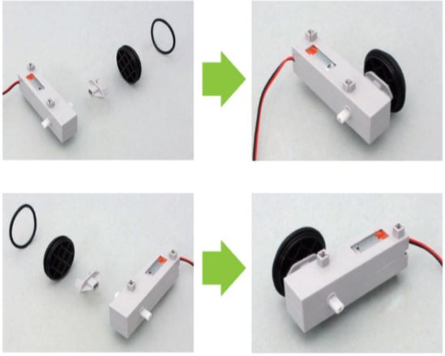

### 2 
Attach a third wheel to the blocks as shown.

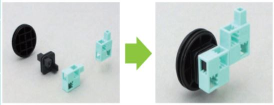

### 3 
Add the **DC Motors** and the part from step 2 to the **Studuino Unit**.
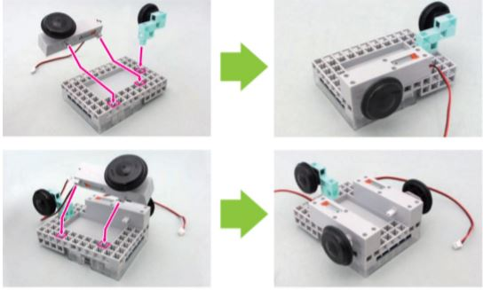

### 4 
Insert the cables for the **DC motors M1 and M2** into the ports shown on the **Studuino Unit**.
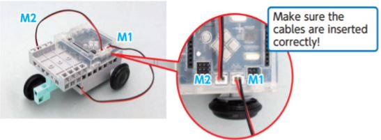

### 5 
Make the two sets of the blocks as shown.

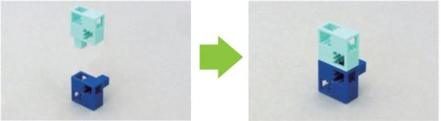

### 6 
Add a **Buzzer** to one of the parts you created from step 5 and then add a **Sensor Cable**
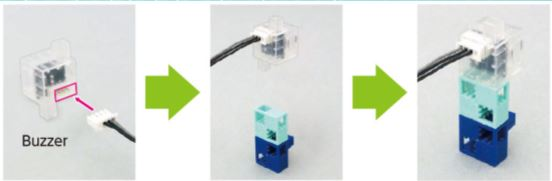

### 7 
Add the parts from step 5 and 6 as shown below.
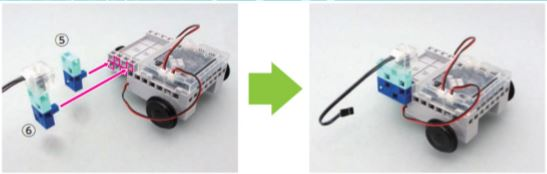

### 8 
Now push the blocks into the base as shown in the image.
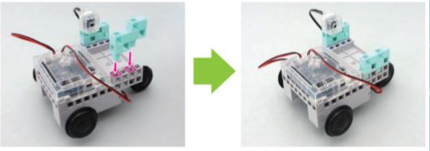

### 9
Place the battery box on the base of the studuino unit. Connect the **Battery Cable** and the **Sensor Cable** to **A5** on the studuino unit.

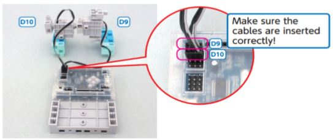

### 10
Connect the **Sensor Cable** to the **IR Photoreflector Sensor** then add the white block as shown below.
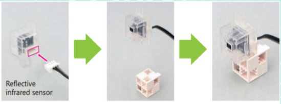

### 11 
Push the part from step 10 into the base of the unit as shown.
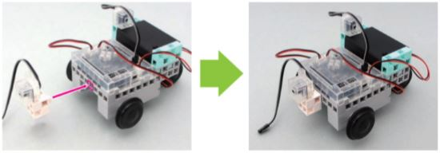

### 12 
Connect the **Reflective Infrared Sensor** to **A4** on the studuino unit.

### 13 
Once you're done, this is what your robot should look like.
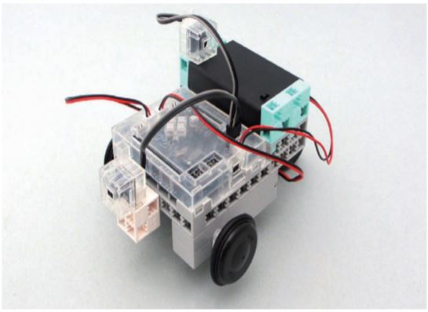

## Great Job Ninja!
You have mastered the art of creating your very own Collision Detecting Robot! Continue on to your next activity lesson!

## Activity 2
### Coding The Collision Detecting Robot 

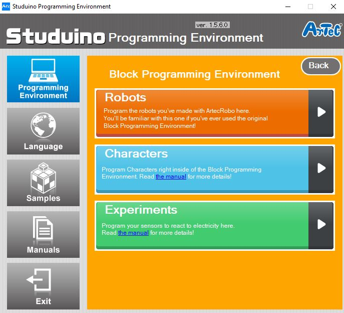

### 1 
The first step for us to do is to go to the port settings and make sure it looks like the picture below.
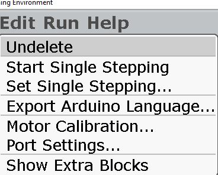
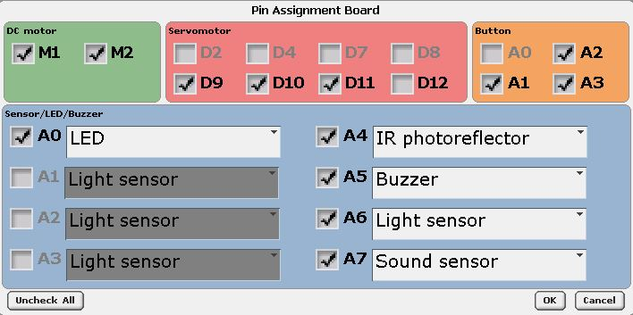

### 2 
After that, we'll start setting up our code. The first thing we'll want to set up is the functions that we will be using later in the program. The first function we're making is going to backup our robot, so grab a function block out of the control menu and name this function **Backup**. Then, go into the **motion** menu and grab 2 of the **dc motor on at** blocks and change them to **M1 and M2 on at CCW** for both. It should look like the picture below.
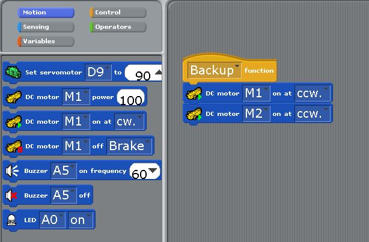

### 3 
Next, we'll set up our **collision function**. This function will tell the robot what to do if it collides with an object. Again, you'll want to go into the **control menu** and grab a function block. This time you'll name it **collision**. Now, go into the **Motion** menu and grab a **DC motor off** block and 2 **DC motor on at** blocks. This function should look like the image below.
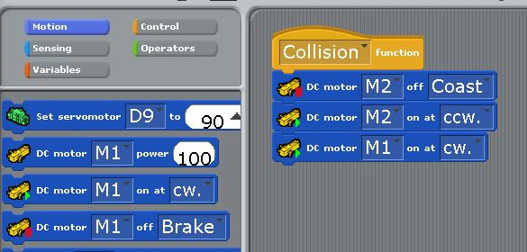

### 4 
Now we'll set up our last function, which will be called the **Forward Function**. This function will make the robot move forward when ever we call the function. Once again, grab a function block out of the **control menu**, and name it **Forward**. Next, go into the **Motion** menu and grab 2 **DC motor on at** blocks and make it look like the image below.
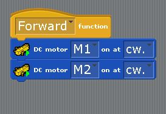

### 5 
Now, we'll set up our main chunk of code. Fist, we'll want to go into the **motion** menu and grab 2 **DC motor power** blocks and put them together and the power at 100. Next, grab a **forever loop**, that'll be in the **control menu**. While still in the **control menu**, get an **if/else statement and 2 repeat until blocks.** You'll put the repeat until blocks inside of if the part of the if/else statement. It should look like the image below.
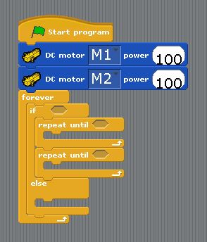

### 6 
Now we'll make the **conditional statement** that will determine whether the robot should avoid and object or not. A **conditional statement** is a block of code that needs certain conditions to do something. Like if the number 4 is bigger than 3, then move forward or something like that. Or in this case, if the IR Photoreflectors value is greater than 2 or is equal to 30, then it will call the backup function that made and it will tell the robot to back up. So go into the **operators** menu and grab a greater than block, equal too block, and an or block, and assemble it like in the picture below.
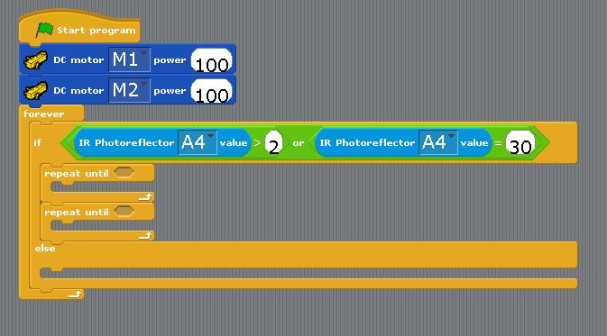
