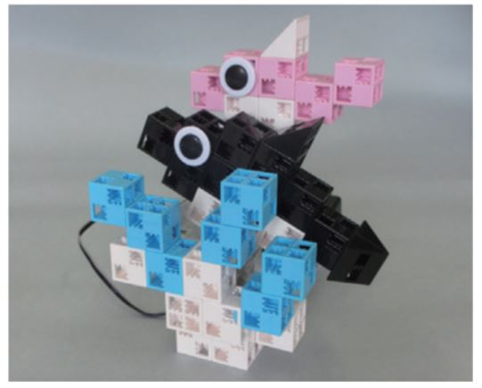

# Double Dolphins Project
## Introduction
> ### Double Dolphins
> Congradulations on making it this far! So far the robots we built have been very practical, well now you'll get to built a work of moving art! 

---

> ### What Will I Learn?
> For this final lesson, it will be more artsy than useful. We will build an animatronic robot of two dolphins that are swimming in the sea.

---

> ### The Main Purpose of Building This Robot:
> The main purpose is to create a robot using all the tools and knowledge that you have obtained so far in these projects.

---

## Activity 1
### Building the Double Dolphins
### What you need to build:
> * 36 White Cubes
> * 4 Grey Triangles
> * 2 Half A Light Grey Blocks
> * Studuino Unit
> * Battery Box
> * USB Cord
> ### Note that the colors of the blocks don't really matter, just make sure you have the right amount of what ever color block you choose.

### 1
### Building the first dolhpin
Assemble the blocks as shown in this picture.

### 2
Assemble 4 white blocks as shown in the picture below.

### 3 
Assemble the 1 triangle block with 3 more color blocks as shown in the picture

### 4 
Add the parts from step 1,2, and 3 together.

### 5
This is what your dolphin should look like without a disk. 

### 6 
### Building the Second Dolphin
Assemble the blocks as shown in the picture. Any color blocks work.

### 7 
Connect 1 triangle block and 3 cube blocks to resemble the picture below.

### 8 
Assemble 3 cubes as shown in this picture.

### 9 
Assemble 2 triangle blocks and 1 cube to resemble the picture below.

### 10 
Assemble the pieces from step 6,7,8, and 9 as depicted in the image.

### 11
This should be the finished piece with your pieces.

### 12
### Making the waves
Assemble 4 cubes to resemble the picture below.

### 13 
Next, assemble 3 cubes to resemble the picture below.

### 14
Assemble 4 cubes to reseble the picture below.

### 15
Assemble the parts from steps 12,13, and 14 as shown in the picture.

### 16
Finally, add the entire piece to the servomotor as shown in the picture.

### Putting the parts together
### 17
Connect 4 blocks and a 1 half block A block to the cubes to resemble the picture below.

### 18 
Add the blocks to the studuino unit as shown in the picture. Add a half A block along side step 17. It's ok if you run out of blocks.

### 19 
Connect the part from step 16 as depicted in the example below.

### 20 
Assemble the parts from steps 12, 13, and 14 as shown below.

### 21 
Add the part from step 6 as shown in the picture.

### 22
Plug the servomotor cable into **D9** and your battery box cable into the **POWER** port on the studuino unit.

### 23
This is what your finished robot should look like.

## Great Job Ninja!
You have mastered the art of creating your very own Double Dolphin Robot! Continue on to your next activity lesson!

## Activity 2
### Coding the Double Dolphins
Now it's time to code your Double Dolphins! Connect your USB to the computer and open Studuino. Select the **Block Programming Environment,** then select the **Robots** tab to transfer code that you'll make to the robot you built!

