# Light Tower Project
## Introduction
> ### Light Tower
> The last few robots you made could move and detect things, well now we're going to make a robot that doesn't move, but still detects or reacts to something. The light tower you are going to build can be turned on by the sound of someone clapping! Not only can it do that, but if you touch the actual touch sensor, then the tower will light up and start making sounds!

---

> ### What Will I Learn?
> In this project you will learn how touch and sound sensors can detect when sound or touch happens.

---

> ### The Main Purpose of Building This Robot:
> The main purpose is for the student to understand what a light tower is and how to make one function by detecting certain events that happen around it.

---

## Activity 1
### Building The Light Tower
### What You Need To Build:
> * Studuino Unit
> * Battery Box
> * LED (red, green, blue, and white)
> * Buzzer
> * Light Sensor
> * Sound Sensor
> * Touch Sensor
> * 8 Basic Cubes
> * 4 Clear Basic Cubes
> * 3 Half B blocks
> * 29 Half C blocks
> * 4 Half D blocks
> * 1 USB cable
> * 8 Sensor connecting cables
> ### Note that the colors of the blocks don't really matter, just make sure you have the right amount of what ever color block you choose.

### 1
The first thing we are going to do is to add the battery box to the studuino unit.
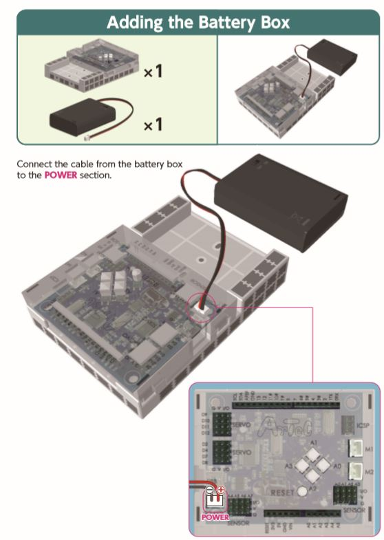

### 2 
Next, we'll assemble the base of the light tower.
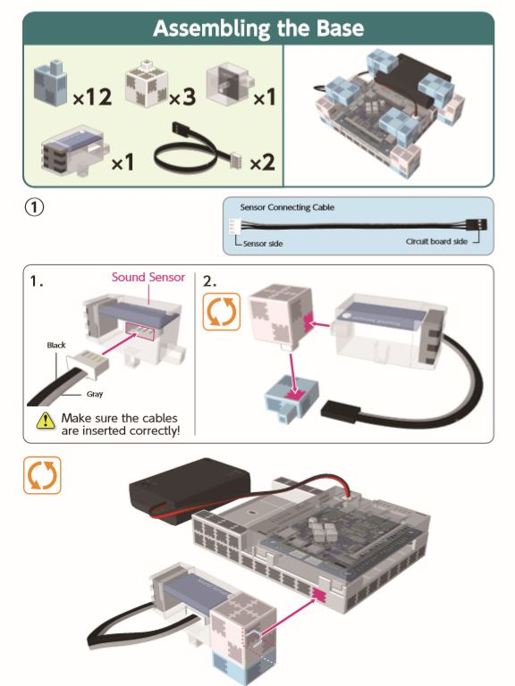
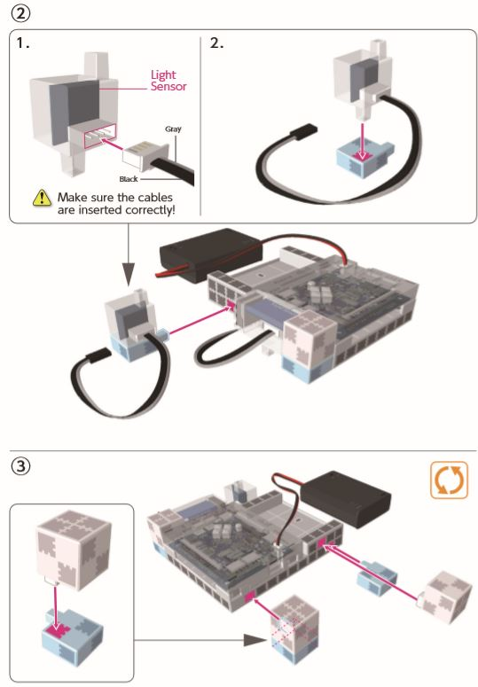

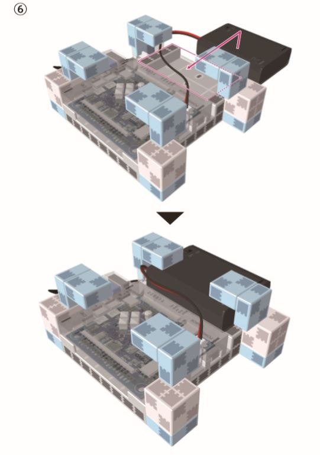

### 3
After step 2, we'll make assemble the **touch sensor** to the blocks.
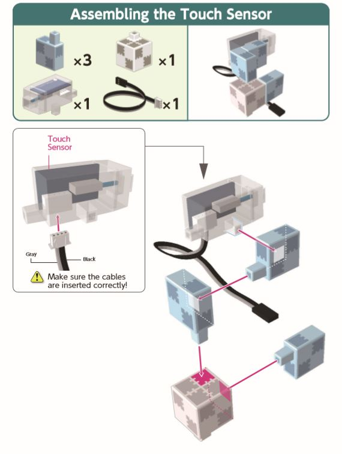

### 4
Now, we'll build the center of the tower.

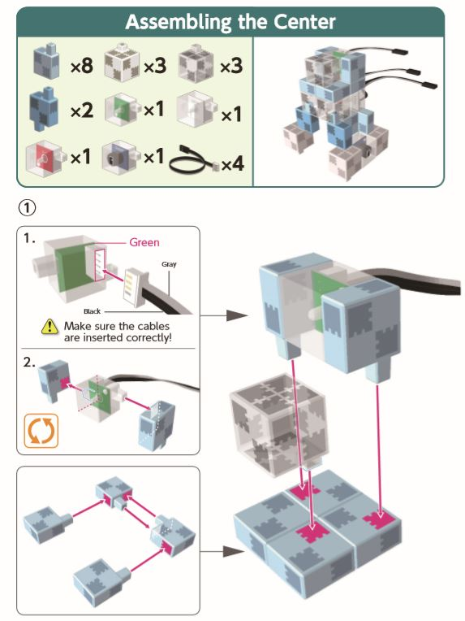
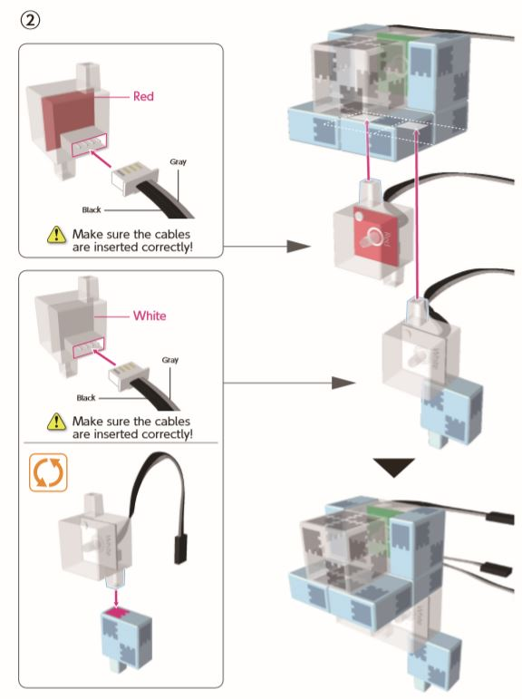
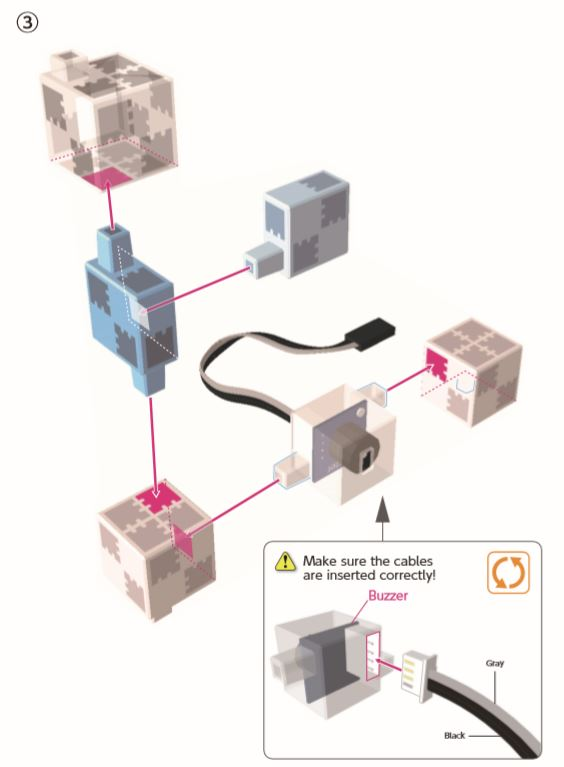
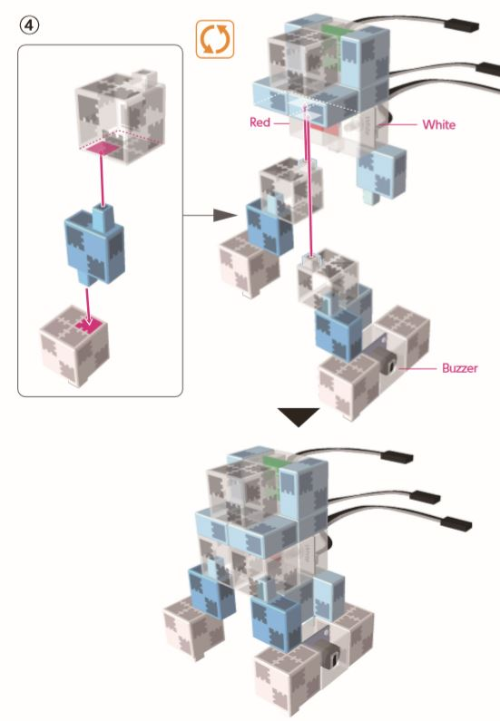

### 5 
One of the last things we need to do is to build the top of the tower.
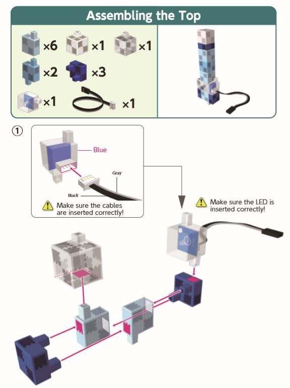
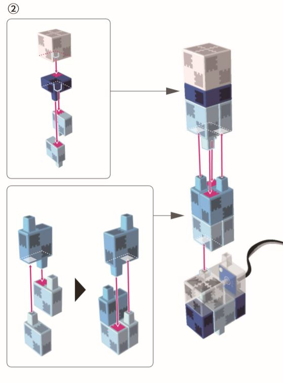

### 6 
Now, we just have to put the parts together. At the end of your steps, your light tower should look like the last picture.

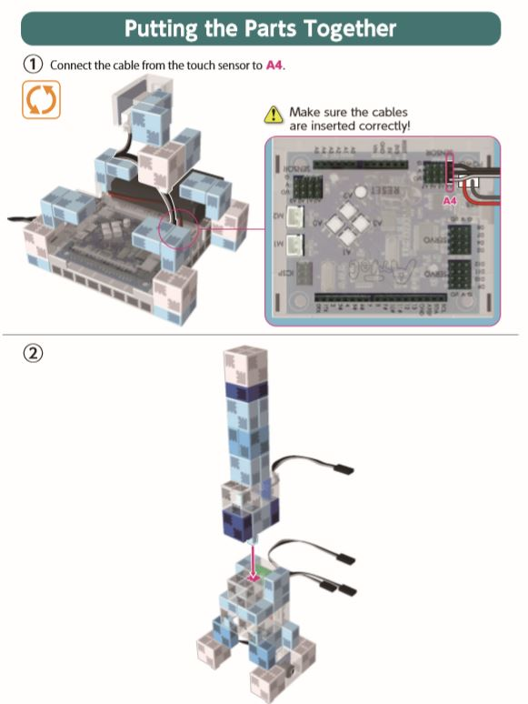
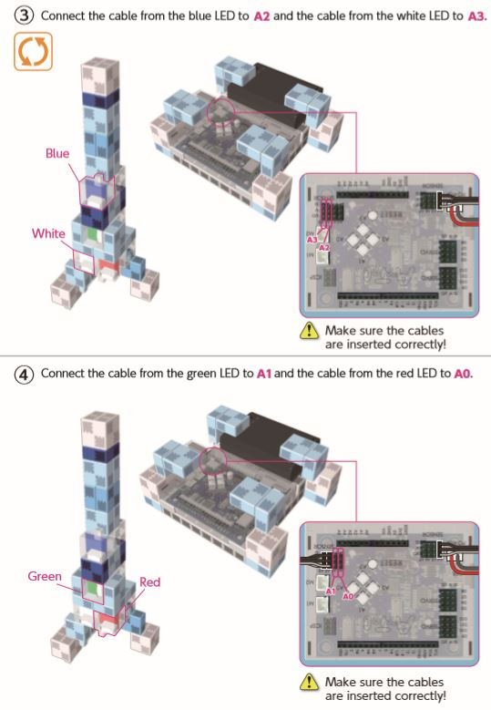
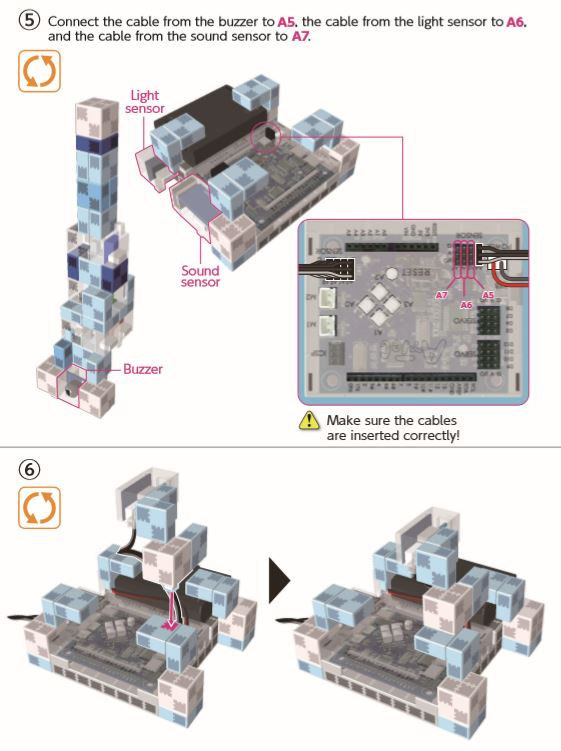
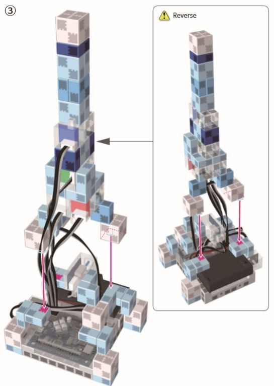
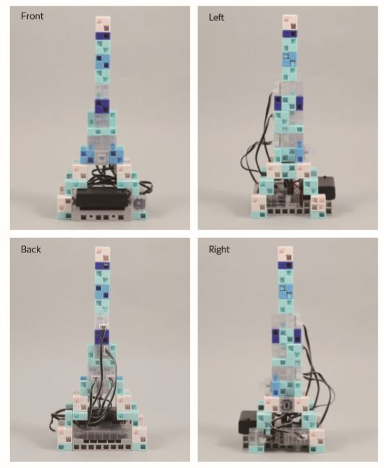

## Great Job Ninja!
You have mastered the art of creating your very own Light Tower! Continue on to your next activity lesson!

## Activity 2
### Coding the Light Tower
Now it's time to code your Light Tower! Connect your USB to the computer and open Studuino. Select the **Block Programming Environment,** then select the **Robots** tab to transfer code that you'll make to the robot you built!

### 1
First thing we will want to do is go into our **port settings**. Once you're in it it should look like the screen below, make sure that the same boxes are checked and everything matches.
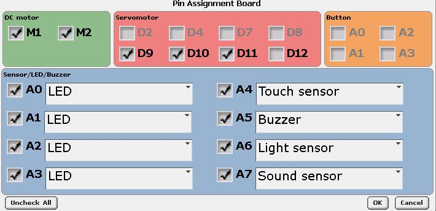

### 2 
Now, lets get 2 function blocks out of the **control** menu name them **song1 and song2**. These functions are going to play certain tones of sounds to make a little song. They should look like the image below.

### 3 
Next, lets set up our main block code that's going to hold the main parts of our code. First, go into the **control** menu and grab 3 if statement and a forever loop. All 3 if statements are going to go into the forever loop. Next, go into the **operators** menu and grab a greater than block, less than block, and equals too block. Put one of those in one if statement, and the same for the other two, so they should all be in 3 different if statements. Next, go into the **sensing** menu, and grab 3 **touch sensor value** blocks and put them in each operator block. Change the sensors to the senors that are in the image below. Make sure that their values match with the image below also. I broke down the first image to help set it up.
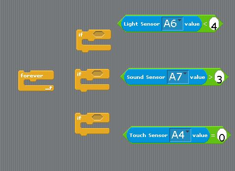
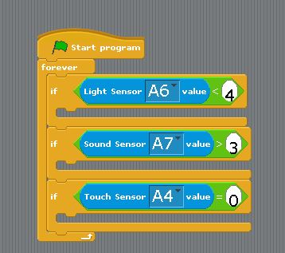

### 4 
Now, we're going to set up our functions. Get ready, because this is a decent amount of code for each function. The first one we'll set up will be the **song1** function. Go into the **control** menu and grab a **song1** function block. Let me just break down the images below to help set up the function. All thos function does in its simplist form is change the frequency of the noise that comes from the buzzer, making it into a loop of sound. Make sure that it matches the image below. There should be a total of **8** wait blocks, **8 buzzer on frequency** blocks, and **8 buzzer off** blocks.
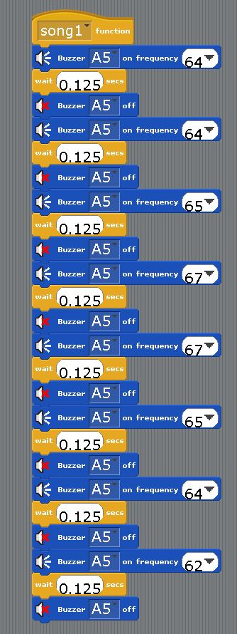

### 5
For the **song2** function, it'll be the same concept, just less code. This one should have a total of **7 wait** blocks, **7 buzzer on frequency** blocks, and **7 buzzer off** blocks.
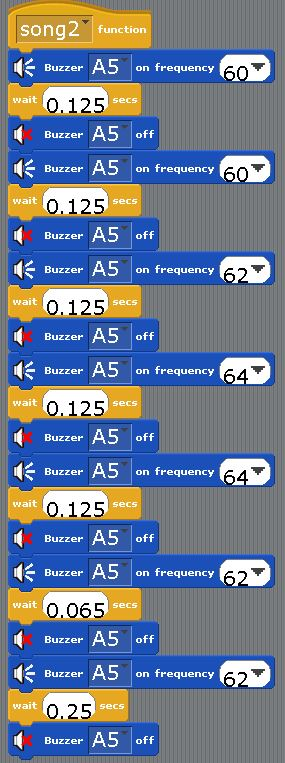
