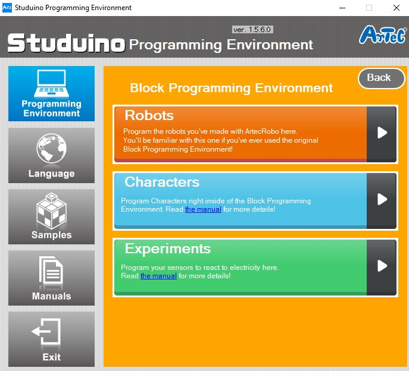

# Line Tracer Project
## Introduction
> ### Line Tracer
> Now that you've just made an art project out of all of the things you have leraned so far, now it's time to get into the complicated projects. It might sound intimidating, but don't let it, it's only going to make you build more awesome robots! This robot is going to be able to trace a line that is front of it, kind of like a self driving car.

---

> ### What Will I Learn?
> In this project you will learn how to build a program a robot to follow a certain line and give it certain conditionals to make sure that it follows those rules of detection.

---

> ### The Main Purpose Of Building This Robot:
> To teach you a new concept of how IR Photorelfectors work and operate at a small and large scale.

---

## Activity 1
### Building the Line Tracer
### What You Need To Build:
> * Studuino Unit
> * Battery Box
> * DC Motor
> * USB Cable
> * Sensor Connecting Cable
> * IR Photoreflector
> * 2 baisc cubes
> * 1 triangle cube
> * 2 half A blocks
> * 6 Half B blocks
> * 13 Half C blocks
> * 1 Half D block
> * 2 Hub Blocks
> * 2 Wheels
> * 2 O-Rings
> * 2 Disks
> ### Note that the colors of the blocks don't really matter, just make sure you have the right amount of what ever color block you choose.

### 1 
The fist part we're going to start on is the bottom of the tracer. To set that up, look at the images below.

### 2
Now we'll assemble the motor. 

### 3
In this step we'll set up the front or "body" of the robot.

### 4
Now, lets set up the head and arms of the roboot.

### 5
The end result of your robot should look similar to the picture below.

## Great Job Ninja!
You have mastered the art of creating your very own Line Tracer Robot! Continue on to your next activity lesson!

## Activity 2
### Coding the Line Tracer
Now it's time to code your Line Tracer! Connect your USB to the computer and open Studuino. Select the **Block Programming Environment,** then select the **Robots** tab to transfer code that you'll make to the robot you built!

