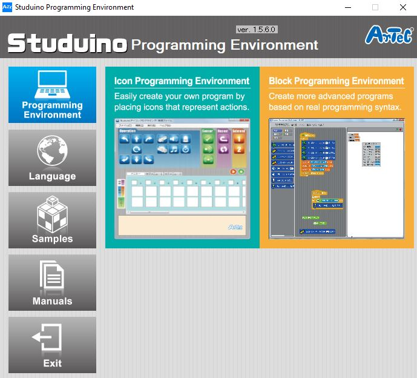

# Line Tracer Project
## Introduction
> ### Line Tracer
> Now that you've just made an art project out of all of the things you have leraned so far, now it's time to get into the complicated projects. It might sound intimidating, but don't let it, it's only going to make you build more awesome robots! This robot is going to be able to trace a line that is front of it, kind of like a self driving car.

---

> ### What Will I Learn?
> In this project you will learn how to build a program a robot to follow a certain line and give it certain conditionals to make sure that it follows those rules of detection.

---

> ### The Main Purpose Of Building This Robot:
> To teach you a new concept of how IR Photorelfectors work and operate at a small and large scale.

---

## Activity 1
### Building the Line Tracer
### What You Need To Build:
> * Studuino Unit
> * Battery Box
> * DC Motor
> * USB Cable
> * Sensor Connecting Cable
> * IR Photoreflector
> * 2 baisc cubes
> * 1 triangle cube
> * 2 half A blocks
> * 6 Half B blocks
> * 13 Half C blocks
> * 1 Half D block
> * 2 Hub Blocks
> * 2 Wheels
> * 2 O-Rings
> * 2 Disks
> ### Note that the colors of the blocks don't really matter, just make sure you have the right amount of what ever color block you choose.

### 1 
The fist part we're going to start on is the bottom of the tracer. To set that up, look at the images below.

### 2
Now we'll assemble the motor. 

### 3
In this step we'll set up the front or "body" of the robot.

### 4
Now, lets set up the head and arms of the roboot.

### 5
The end result of your robot should look similar to the picture below.

## Great Job Ninja!
You have mastered the art of creating your very own Line Tracer Robot! Continue on to your next activity lesson!

## Activity 2
### Coding the Line Tracer
Now it's time to code your Line Tracer! Connect your USB to the computer and open Studuino. Select the **Block Programming Environment,** then select the **Robots** tab to transfer code that you'll make to the robot you built!

### 1
This first thing we will want to do is go into the **edit** menu and click on **port settings**, just like in the other projects. 

### 2 
Now, make sure that the port settings look like the picture below.

### 3
After that, go into the **motion** menu and grab 2 **DC Motor power** code blocks and put them together, make one at **M1** and the other at **M2**, and set their power at 60. Next, go into the **control menu** and grab a wait block and put it at the end of the motion blocks.

### 4
Now, lets go into the **control** menu again and get a forever loop and put that on the end of our wait block. Next, go into the **operators** menu and grab a less than block. Type 45 in the right white space, and go into the **sensing** menu and grab a **IR Photoreflector value** block and put it in the left white space. This is saying that if the photorelfector's value is less than 45, it will do something. We're going to put that into an if/then statement inside of the forever loop.

### 5 
Next, lets set up the inside of the if/else statement. Go into the **motion** menu and get 2 of the **DC motor off** blocks and 2 of the **DC motor on at** blocks. Put 2 of each insided the if/then statement and change them to what the picture has them as below.

### 6
Now, we're going to put all of that code together. It should look like the image below.

### 7
The last thing we want to do it is to go into the **run** menu and click on **transfer**. Make sure that the **USB** cable is conmnecting the robot to the computer before you hit transfer or else it won't work at all! 

## Congradulations! You built and programmed a Line Tracing Robot!
