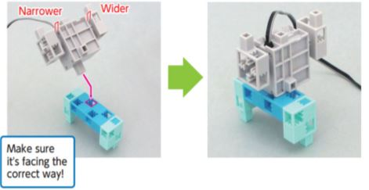
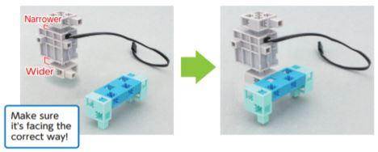
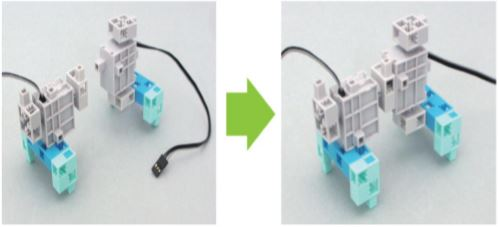
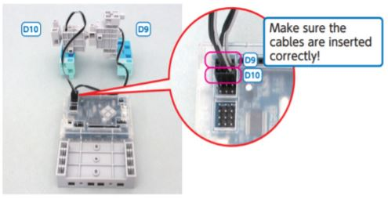
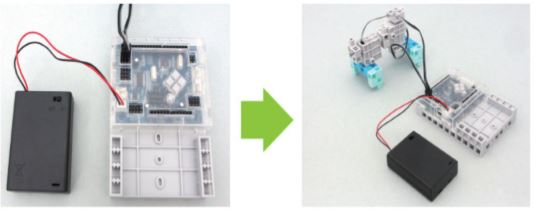
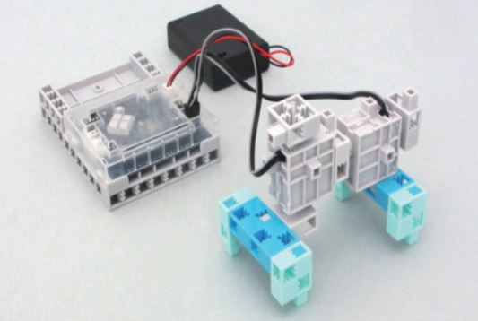
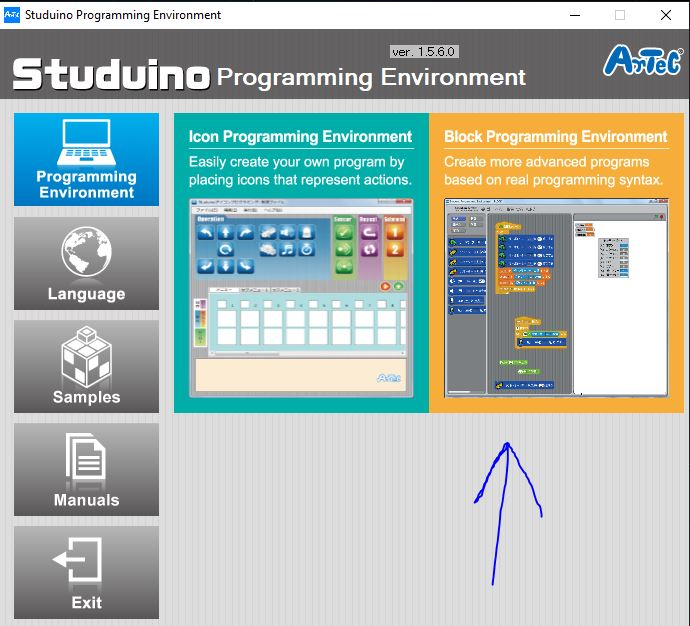
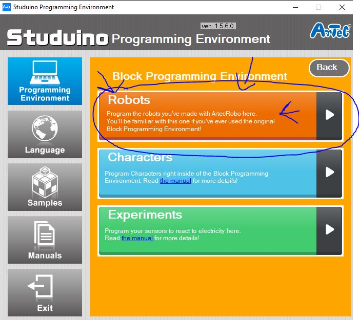
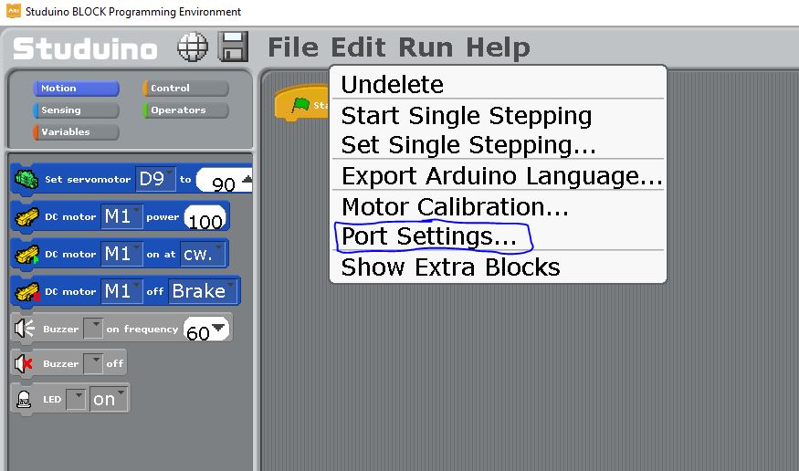
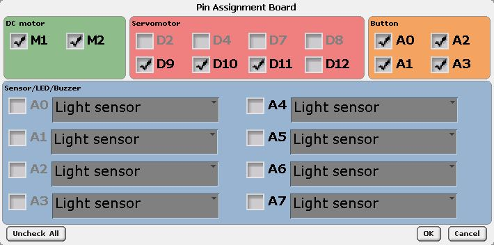

# Servo Walker Project 
## Introduction
> #### Servo Walker 
> Before a person can learn to walk, they usually crawl. That's what the main function of what the Servo Walker does, which is crawling with its front two legs, or in this case blocks. And conveniently, that is what we are going to create in this project!

---

> #### What Will I Learn?
> This project will teach you how to create a simple moving, yet stationary robot using a servomotor and a small amount of parts.

---

> #### The Main Purpose Of Building This Robot:
> As you continue to build more robots in this workshop, you will learn how building stationary robots prepars you to build robots that move by directed actions or self-programming.

---

## Activity 1
### Building the ServoWalker!
Before building the robot, we need to go over a few things about the motor we will be using, which is called a **servomotor**. There is a wide and narrow side of the motor, it's important we know which side is which, or we will end up building it wrong! 

> ### Fun Fact
> Servomotors are usually refered to as "servos" and they play a big part in radio-controlled airplanes, like helping to position control surfaces like elevators to help with elevation and rudders to help turn the aircraft!

### What you need to build:
> * Studuino Unit
> * Battery Box
> * USB Cable
> * 4 Light Aqua Blocks
> * 4 Aqua Blocks
> * 2 Servomotors

---

### 1
start by making two sets of the blocks shown below.

### 2 
As shown below, add the **D10 Servomotor** to one set of the blocks you created in the previous step.

### 3 
Add the **D9 Servomotor** to the remaining set of blocks as shown.

### 4 
Assemble the parts as shown in the image.

### 5 
insert hte cables for the **D9 and D10 Servomotors** into the ports shown on the circuit board.

### 6 
now add the **battery box**.

### 7 
This is what your completed robot should resemble.

## Great Job Ninja!
You have mastered the art of creating your very own Servo Walker! Continue on to your next activity lesson!

## Activity 2
### Coding The Walker 
Now it's time to code your Servo Walker! Connect your USB to the computer and open Studuino. Select the **Block Programming Environment,** then select the **Robots** tab to transfer code that you'll make to the robot you built!
  

### 1
Go to the **edit** menu and select **Port Settings** from the drop-down. 

### 2 
Make sure that you **Check all of the boxes that are checked below**. Then click **ok**.

### 3 

