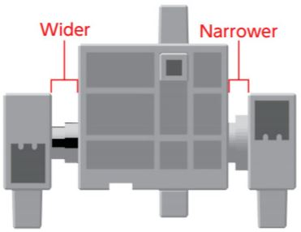
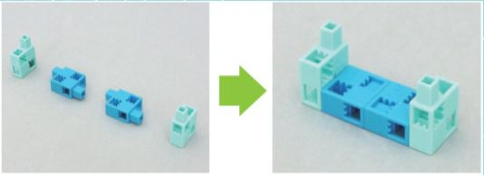

# Servo Walker Project 
## Introduction
> #### Servo Walker 
> Before a person can learn to walk, they usually crawl. That's what the main function of what the Servo Walker does, which is crawling with its front two legs, or in this case blocks. And conveniently, that is what we are going to create in this project!

---

> #### What Will I Learn?
> This project will teach you how to create a simple moving, yet stationary robot using a servomotor and a small amount of parts.

---

> #### The Main Purpose Of Building This Robot:
> As you continue to build more robots in this workshop, you will learn how building stationary robots prepars you to build robots that move by directed actions or self-programming.

---

## Activity 1
### Building the ServoWalker!
Before building the robot, we need to go over a few things about the motor we will be using, which is called a **servomotor**. There is a wide and narrow side of the motor, it's important we know which side is which, or we will end up building it wrong! 

### What you need to build:
> * Studino Unit
> * Battery Box
> * USB Cable
> * 4 Light Aqua Blocks
> * 4 Aqua Blocks
> * 2 Servomotors

---

### 1
start by making two sets of the blocks shown below.

