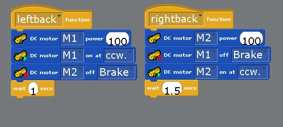

# Turn Robot Project
## Introduction
> ### Turn Robot
> This project is all about touch! This robot will back up and move away from the direction that it was pressed from, using 1 or 2 sensors!

---

> ### What Will I Learn?
> You will learn how to call functions depending on if a conditional that you program is met. The functions will turn the robot in a different direction and move it that new direction.

---

> ### The Main Purpose of Building This Robot:
> To understand how a robot can sense that it is being touched and to make it do something when it is touched.

---

## Activity 1
### Building the Turn Robot
### What You Need To Build:
> * Studuino Unit
> * Battery Box
> * USB Cable
> * DC Motor
> * Sensor Connecting Cable
> * Touch Sensor
> * 2 Basic Cube
> * 4 Triange A blocks
> * 2 Half A blocks
> * 6 Half B blocks
> * 11 Half C blocks
> * 2 Half D blocks
> * 2 Hubs
> * 2 Wheels
> * 2 O-Rings
> * 2 Disk

### 1 
First, let's make the bottom of the robot.

### 2 
Now, let's assemble the motor, which is a DC motor.

### 3 
Next, lets assemble the front of the robot.

### 4 
After that, let's set up the sensor portion of the robot.

### 5 
Finally, let's set up the head of the robot.

This is what the robot should look like after you are done with this last step.

## Great Job Ninja!
You have mastered the art of creating your very own Turn Robot! Continue on to your next activity lesson!

## Activity 2
### Coding the Light Tower
Now it's time to code your Turn Robot! Connect your USB to the computer and open Studuino. Select the **Block Programming Environment,** then select the **Robots** tab to transfer code that you'll make to the robot you built!

### 1 
First thing we will want to do is go into our **port settings**. Once you're in it it should look like the screen below, make sure that the same boxes are checked and everything matches.

### 2 
Now, let's start by making some of the functions we're going to be using. Let's start with our **leftBack** function. Go into the **control** menu and grab a function block and name it **leftBack**. Then, go into the **motion** menu and grab 2 **DC Motor on at** and 2 **DC Motor power** blocks and put them in the function. After that, grab a wait block from the **control** menu and change the wait time to .5 instead of 1. Then go back into the **motion** menu and grab a **DC motor on at**, **DC motor power, and DC motor off** blocks, then finish it up with another wait block that only waits 1 second. Make sure it looks like the image below.

### 3 
Next, let's make our final function for the turn robot. This function will make the robot backup and turn away from what ever object was in front of it. First, let's start with going into the **control** menu and grabbing a new function block. I named mine **back_and_leftback** to help you understand what the function does overall, but you can name it something shorter if you'd like. Next, go into the **motion** menu and grab **2 DC power** blocks and **2 DC motor on at** blocks. Put them together and change the numbers and rotation to what is in the picture below. Now, grab a **wait** block out of the **Control** menu and change it from 1 seconds to .5 seconds. Then, go back into the **motion** menu and grab a **DC motor power block, DC motor on at block, and a DC motor off block**, and put them together. Next, change the blocks to match what is in the picture below. The end result should look like the picture.

### 4
After that, let's make the main block of code that our turn robot is going to use. First, let's start with a wait block from the **control menu**, and leave it at 1 second. Next, grab a forever block also from the **control menu**. Inside of that forever loop, you're going to inset 2 **DC motor power blocks and 2 DC motor on at blocks** from the **motion menu**, then finish that off with a wait block that's set to 1 second. It should look like the image below.

### 5
Now, let's set up the conditionals that are going to be used to call our functions. All of our conditionals are going to have an **and** block from the **operators menu**, grab 3 of those. Also while still in the operators menu, grab 6 equal too signs. Go into the **Sensing menu** and grab 6 touch sensor value blocks and put them inside the equal too blocks. You should 6 sets of touch sensor value blocks inside the equal too blocks. Next, put 2 sets into 1 of the and blocks. Do this for all of them, so you should end up with code that looks like the picture below. Make sure that you change the values to what is in the picture below, or else it won't work properly.

### 6
Next, we're going to put the conditonals we made into some if statements. So go into the **control menu** and grab 3 if statements and stack them on top of eachother. Next, put each condtional into each if statement, but make sure it's in the order of the picture, or else the condtionals won't call the right function. After that, go into the **control menu** and grab 3 function blocks and put 1 of each in each if statement, and change what functions to call according to the picture below.

### 7
Finally, let's combine the code we just made with our main block of code. Add the group of if statements to the bottom of the wait statement in the main block of code, but still inside of the forever loop. It should look like the picture below.

### 8
And for our last step, make sure that the robot and computer are connected with a **USB cable**. Once you're sure that they are, go to the **run** button, and hit transfer.

## Congradulations! You built and programmed a Turn Robot!
